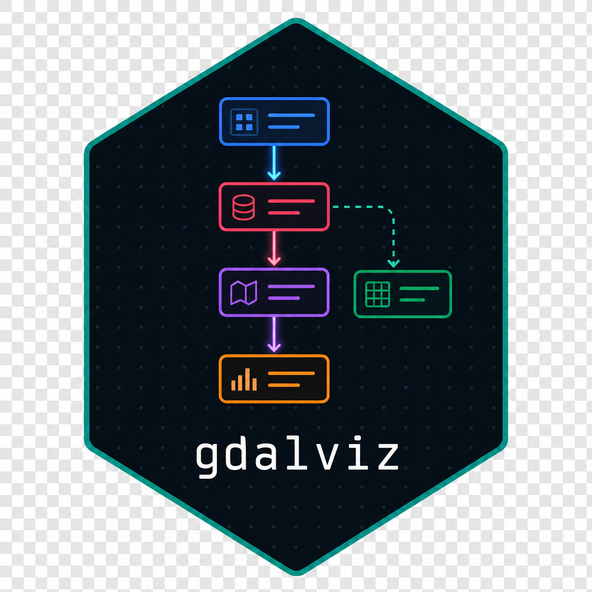
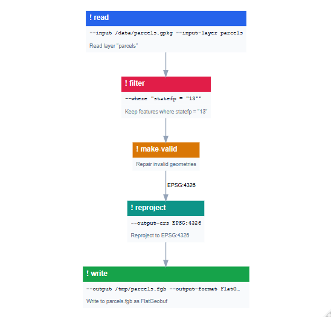
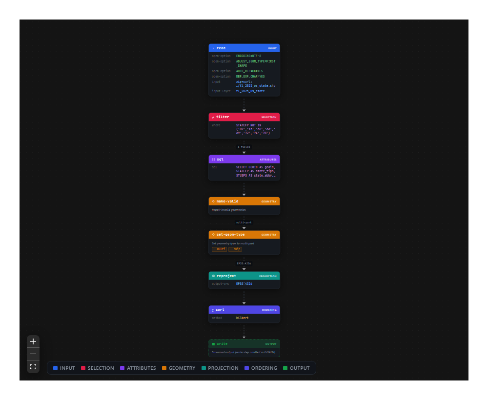

# gdalviz 

<!-- badges: start -->
[](https://github.com/jimbrig/gdalviz/actions/workflows/check.yml)
[](https://github.com/jimbrig/gdalviz/actions/workflows/pkgdown.yml)
[](https://github.com/jimbrig/gdalviz/actions/workflows/changelog.yml)
[](https://lifecycle.r-lib.org/articles/stages.html#experimental)
<!-- badges: end -->

`gdalviz` provides a modern framework for parsing, validating, and visualizing GDAL pipeline algorithms (for example `gdal vector pipeline ! ...` and GDALG `command_line` definitions).

- **Contract-driven**: steps and arguments are validated against GDAL's own `--json-usage` metadata (bundled snapshot, refreshable from your installed GDAL via `gdalviz_refresh_contract()`).
- **Flexible input**: raw pipeline strings, `.gdalg.json` files, and pasted bash/PowerShell scripts (line continuations and heredocs are normalized automatically).
- **Semantic graphs**: `pipeline_graph()` builds a renderer-agnostic dataflow model with category classification, feature-stream state propagation (CRS, geometry, fields), runtime `--config` grouping, the GDALG-omitted write step, and merging of long repeated-step runs (e.g. `set-field-type` chains).
- **Renderers**: interactive React Flow (`render_reactflow()`, bundled - no node toolchain needed), AntV G6 (`render_g6()`), and static Graphviz (`render_diagrammer()`).

## Installation

You can install the development version of gdalviz like so:

```R
pak::pak("jimbrig/gdalviz")
```

## Example

Parse, validate, and render a modern GDAL vector pipeline:

``` r
library(gdalviz)

cmd <- paste(
  "gdal vector pipeline",
  "read --input /data/parcels.gpkg --input-layer parcels",
  "! filter --where \"statefp = '13'\"",
  "! make-valid",
  "! reproject --output-crs EPSG:4326",
  "! write --output /tmp/parcels.fgb --output-format FlatGeobuf"
)

p <- parse_pipeline(cmd)
v <- validate_pipeline(p, strict = FALSE)
issues <- lint_pipeline(p)

g <- pipeline_graph(p)
render_diagrammer(g)
```



or use the *react-flow* based interactive renderer:

```R
system.file("extdata", "pipelines", "tiger_states.gdalg.json", package = "gdalviz") |>
  pipeline_graph() |>
  render_reactflow(theme = "dark", minimap = FALSE, direction = "TB")
```



<!-- CHECKPOINT id="ckpt_mrh2jchk_95i970" time="2026-07-12T00:42:00.056Z" note="auto" fixes=0 questions=0 highlights=0 sections="" -->
